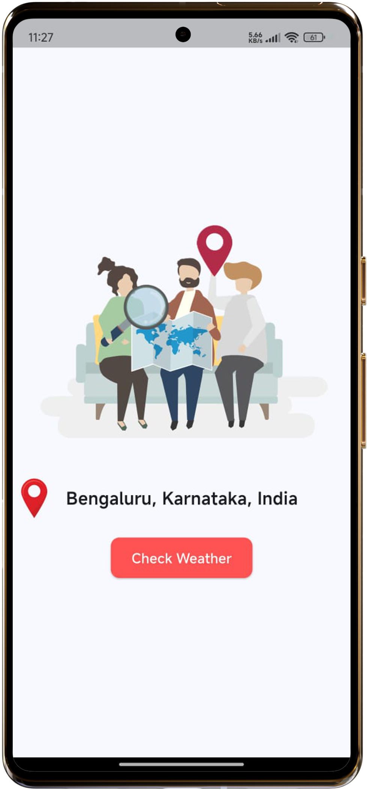
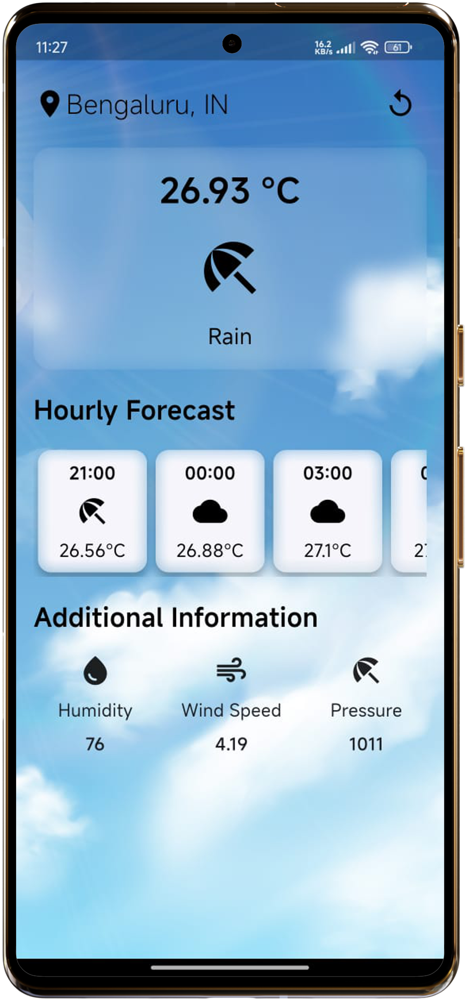

# 🌦️ Weather App

A beautiful and responsive Flutter app that provides real-time weather updates, including current temperature, weather conditions, hourly forecast, and additional details like humidity, wind speed, and pressure.

## 📱 Screenshots

### 📍 Location Screen

### 🌤️ Weather Screen

## 🚀 Features

- Get weather by current location
- Displays:
  - Current temperature and conditions
  - Hourly forecast with icons and temperatures
  - Humidity, wind speed, and pressure
- Animated UI with background image
- Responsive design
- Geolocation integration
- Modern and minimal UI using Flutter

## 🔐 API & Security

- Uses a weather API for data (API key should be stored securely)
- Do **not** commit your API key to the repository
- Use `dotenv` or a config file excluded by `.gitignore`

## 📦 Dependencies

- `http`
- `geolocator`
- `flutter_svg`
- `flutter_dotenv` *(optional for API key hiding)*

👨‍💻 Developed By
Manish Kumar Patel
Flutter Developer | Bengaluru, India
LinkedIn | GitHub
